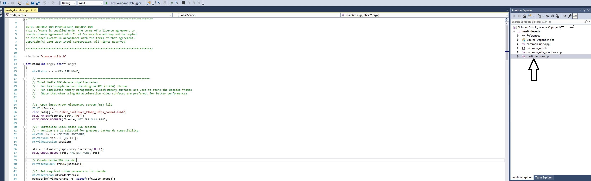

# Decoding a video stream using Intel(R) Media SDK
In this tutorial you will learn the basic principles behind decoding a video stream using the Intel(R) Media SDK. You will understand how to configure the Intel(R) Media SDK pipeline to decode a 4K 30fps AVC stream initially using a software decode implementation and then optimising the code to utilise hardware based decoding.

## Getting Started

- Load the **'msdk_decode'** Visual Studio solution file > **"Retail_Workshop\msdk_decode\msdk_decode.sln"**

- Once Visual Studio has loaded expand the **msdk_decode** project in the **Solution Explorer** in the right-hand pane.

- Double-click on the **msdk_decode.cpp** file to load the main application code.

## Understanding The Code
Take a look through the existing code using the comments as a guide. This example shows the minimum API usage to decode a H.264 stream.

The basic flow is outlined below:

 1. Specify input file to decode
 2. Initialise a new Media SDK session and Decoder
 3. Configure basic video parameters (e.g. codec)
 4. Create buffers and query parameters
	- Allocate a bit stream buffer to store encoded data before processing
	- Read the header from the input file and use this to populate the rest of the video parameters
	- Run a query to check for the validity and SDK support of these parameters
 5. Allocate the surfaces (video frame working memory) required by the decoder
 6. Initialise the decoder
 7. Start the decoding process:
	- The first loop runs until the entire stream has been decoded
	- The second loop drains the decoding pipeline once the end of the stream is reached
8. Clean-up resources (e.g. buffers, file handles) and end the session.
