# Intel(R) Media Accelerator Reference Software (M.A.R.S)
The main goal of the Intel(R) Media Accelerator Reference Software is to demonstrate video acceleration  
using the Intel(R) Media SDK for digital signage use-case. M.A.R.S is licensed reference code showcasing best practices for video decode, playback, compositing, blending and rendering on Intel platforms. In this tutorial we will be using M.A.R.S to showcase the media capabilities of recent Intel platforms and advanced features of the Intel(R) Media SDK.

> The M.A.R.S source code can be obtained via the Intel(R) Registration Center. Please ask for more details.

M.A.R.S supports WIndows 10, 64-bit and runs on the following Intel platforms:

 - Intel(R) 6th Generation Core
 - Intel(R) 7th Generation Core
 - Intel(R) Atom(R) Processor (Formerly Apollo Lake)
 - Intel(R) Atom(R) Processor (Formerly Braswell)

A few of the key features of M.A.R.S are listed below:

 - Support for multiple monitors (e.g. video wall)
 - Portrait & landscape support
 - Multiple zones
 - Various content supported (Video, Audio, Image, RSS, Plain Text)
 - Configuration GUI
> For more information on M.A.R.S you will find the user guide in the **Retail_Workshop** directory.

## Getting Started
Let's start by launching the M.A.R.S application by typing **MARS** into the Windows search bar and clicking the **M.A.R.S** desktop application when it appears.

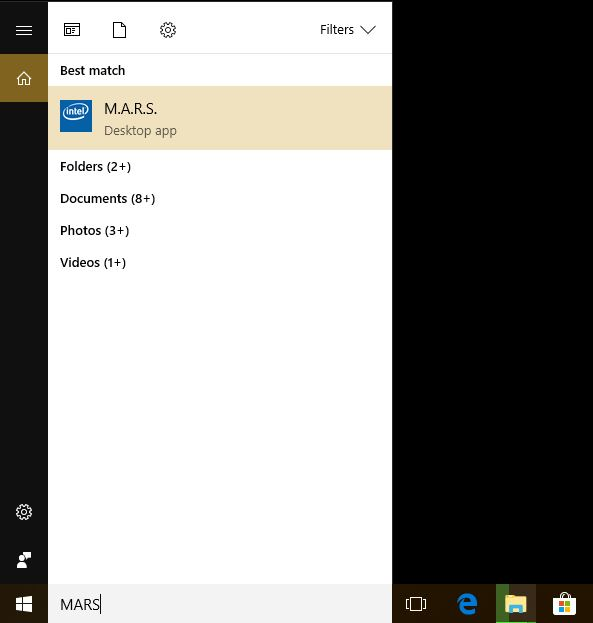

When the application launches you will be greeted with the **default** Full HD configuration which shows multiple overlapping **zones** containing various components including **videos**, **tickers** and **images**.

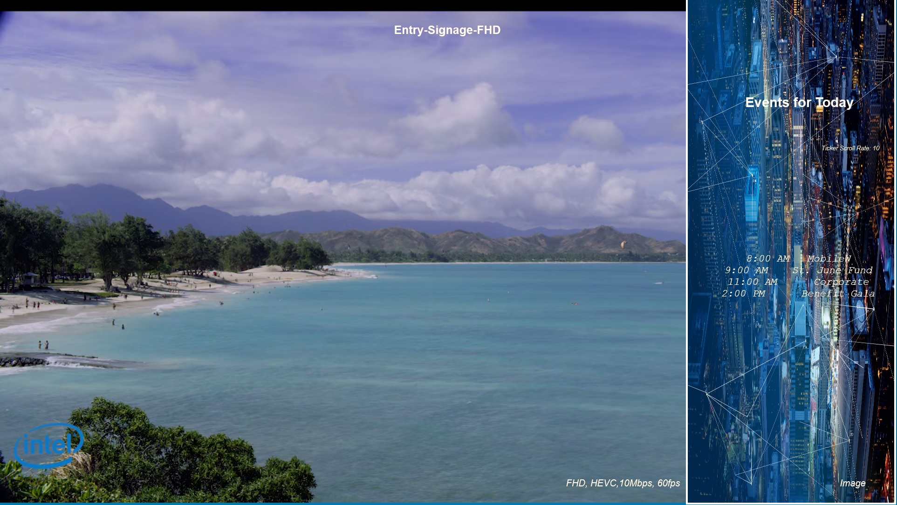

To get to the M.A.R.S configuration GUI press the **"s"** key on your keyboard. The currently loaded configuration is shown in the top most pane. Below this is the **Display Unit Configuration** options where you can define things such as orientation, resolution and audio output for all connected displays. We then have the main **layout** configuration area where you can define zones and place them in the available space on the display unit.

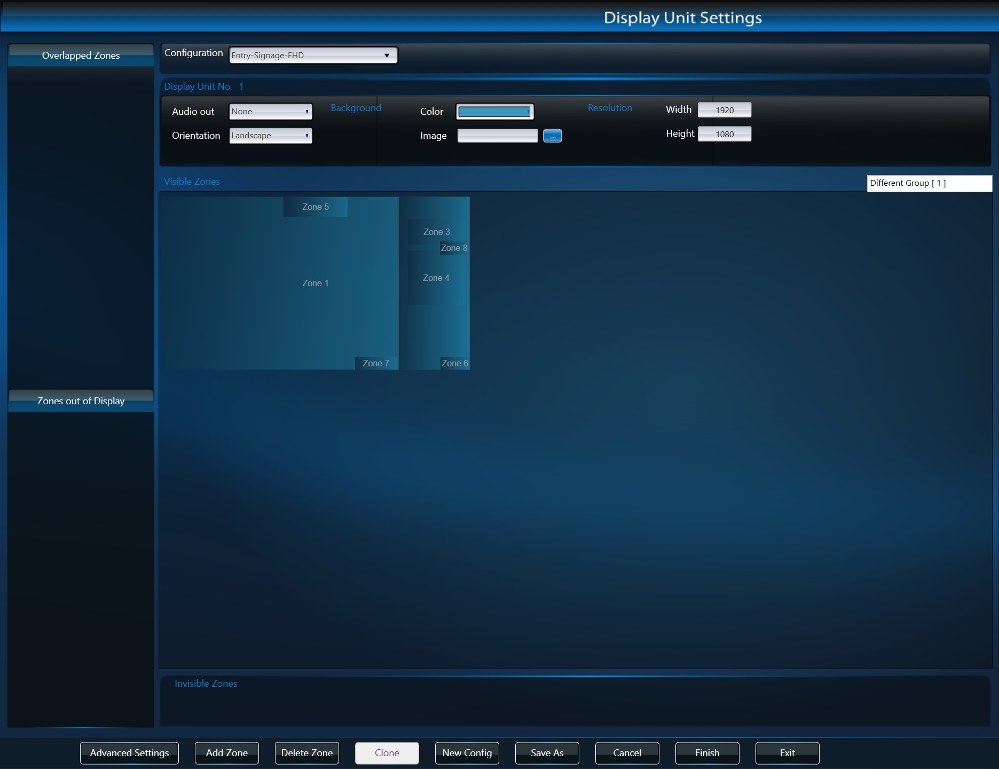

When you click on a **zone** the **zone configuration pane** on the right-hand side will populate allowing you to configure various options based on the **content type** selected. You will also notice that if the zone has **overlapping zones** these will be shown in the **Overlapped Zones** pane on the left-hand side so you can still select them when not visible in the **Visible Zones** pane.

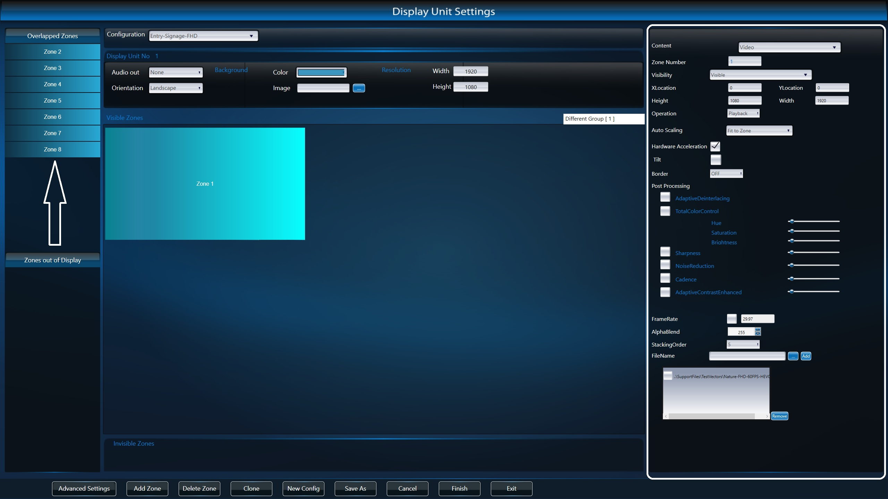

After making changes to the configuration of the various zones you can test by clicking the **Finish** button in the navigation pane at the bottom of the GUI. The **Exit** button closes the application when in the configuration GUI. You can also press **"q"** on your keyboard to exit the application when **NOT** in the configuration GUI.

Continue to explore the **configuration GUI** to familiarise yourself before continuing to the next section.

## 4K Configuration
You will have noticed that because the default configuration is designed for displays with a resolution of **1920x1080** it doesn't fill the 4K resolution displays we are using. We will now create a new config designed for a resolution of **3840x2160**.

Start by clicking the **New Config** button in the bottom pane. We then need to update the **Resolution** configuration of our **display unit**. Change the **Width** to **3840** and **Height** to **2160** and then click in the **Visible Zones** pane to expand our working area.

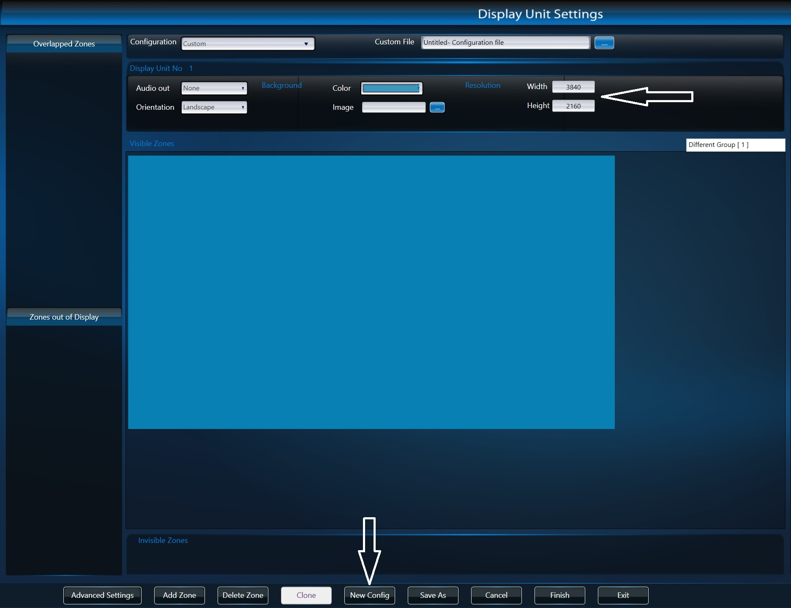

Next add a new zone using the **Add Zone** button. You will see **Zone 1** appear in the **Visible Zones** window. You can drag the zone around the display unit working area and also resize it by dragging the corners or edges of the zone. We want to make this zone fill the entire display. To do this easily hold down the **Ctrl** key and click on the zone. This will automatically size the zone to the available space.

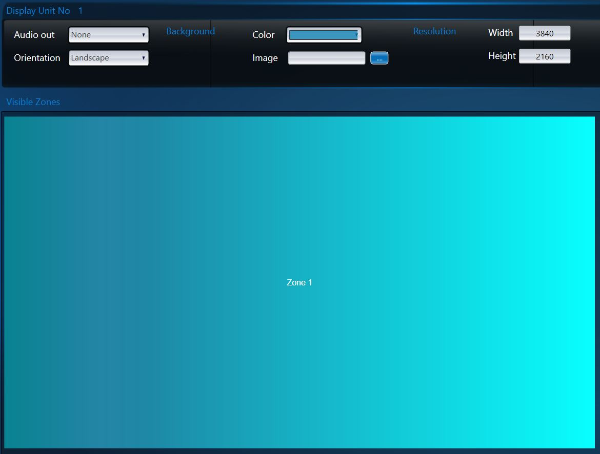

Next we need to configure the zone content. We will be playing back video content in this zone which should be the default but just in case ensure that **Content** is set to **Video** and **Hardware Acceleration** is ticked. Feel free to play with the rest of the configuration options later on.

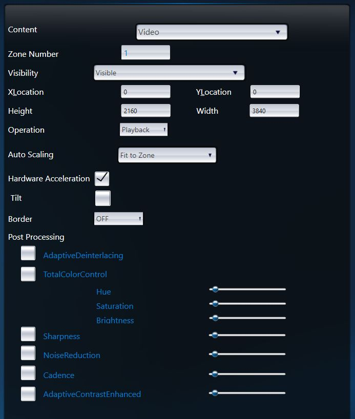

Next we need to tell M.A.R.S what content to play in this zone. To do this click the ***".."*** button next to the **FileName** field to open an explorer window. We have provided some sample content you can use in the **Samples** directory on the **Desktop**. As this is a 4K zone select the **City-UHD-60FPS-HEVC-12.2Mbps-Landscape.mp4** file which is a 60FPS HEVC 4K video file. Finally, click the **Add** button. The file should then appear in the box below as in the following screenshot.

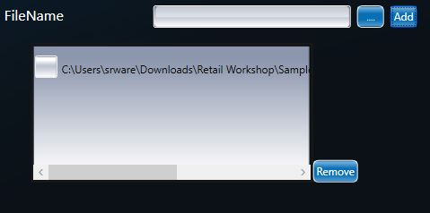

Before we test click the **Save** button in the bottom pane of the M.A.R.S interface which will load an explorer window. Give your configuration file a name and click **Save**. This will save your configuration in XML format to disk so you can reload it into M.A.R.S at any time.

>**Note:** It doesn't matter where you save the configuration file as long as you know where it is but I would recommend saving to the **Desktop** to avoid confusion.

Now we can test our current configuration by clicking the **Finish** button in the M.A.R.S interface. Right now we have a very simple video player, so let's add some more zones. 

> To get back to the configuration GUI press the **"s"** key on your keyboard.

Next we will add a second video zone to display additional content in the top left corner. Add a second zone by clicking the **Add Zone** button. You can make this zone as big or small as you like but I would recommend setting **Height** to **540** and **Width** to **960** in the zone configuration to maintain the correct aspect ratio of the video.

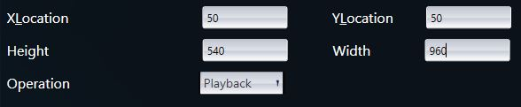

As this zone will be overlapping with our main video zone we can add a border to help it stand out. To do this set the **Border** configuration option to **ON**. This will give you some additional configuration options. Set the **Thickness** parameter to **4**.

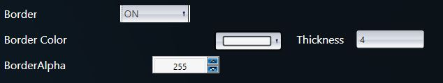

Finally we need to set the content for the zone. This time select the **bbb_sunflower_1080p_60fps_normal.mp4** file in the **Samples** directory on the **Desktop** and click **Add** as you did before. You should now have a layout similar to the screenshot below.

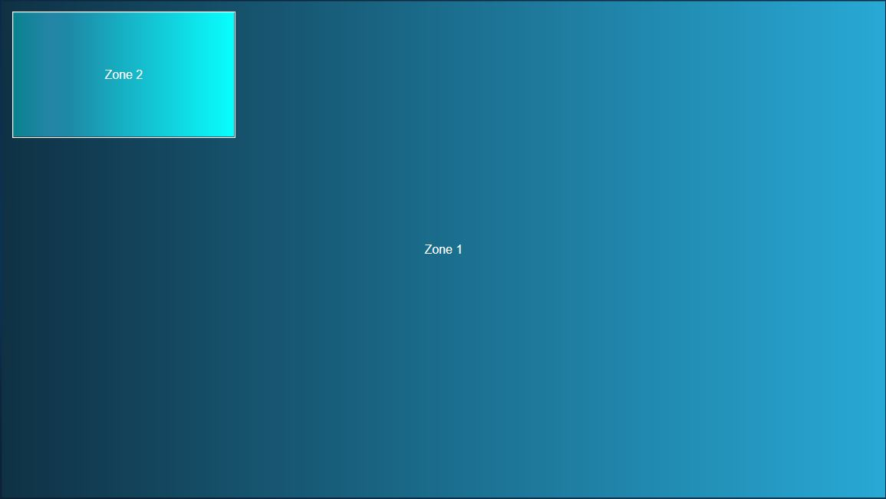

Click **Save** and **Finish** to test your configuration.

> To get back to the configuration GUI press the **"s"** key on your keyboard.

Next we will add an **RSS Feed** to display dynamic content along the bottom of the screen. To do this click the **Add Zone** button to add a third zone to your layout. Drag this zone to the bottom left corner of the screen and then resize it to the entire width of the display by dragging the right edge of the zone. Resize the height of the zone by dragging from the top edge to make it as thin as possible. You can also manually set the **Height** to **83** and **Width** to **3840** in the zone configuration pane. Your layout should now look like the screenshot below.

 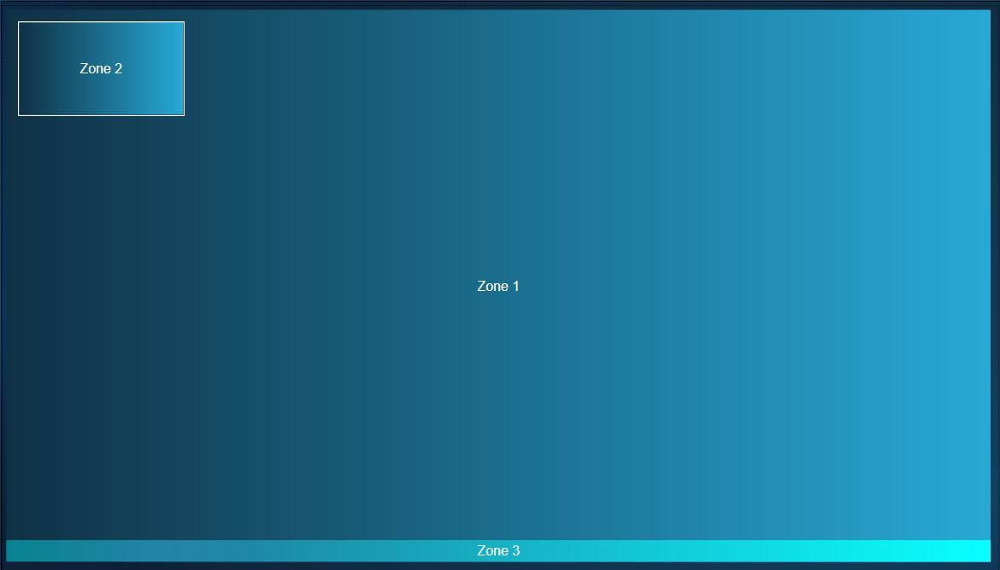

We now need to configure **Zone 3**. Update the following zone configuration parameters:

 - **Content:** RSS
 - **URL:** http://feeds.bbci.co.uk/news/england/rss.xml
 - **Font Size:** 40
 - **Font Style:** Normal
 - **Scroll Direction:** Horizontal

> Set the **Text Color** and **Text Background Color** to whatever you wish.

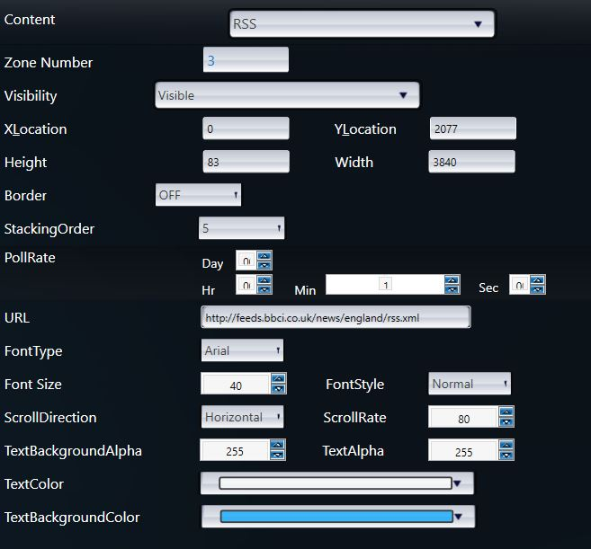

Once again click **Save** and then **Finish** to see the configuration in action.

## Next Steps
Hopefully you now have an idea of the basic workflow and functionality of M.A.R.S. Please feel free to continue adding zones and playing with the available configuration options.
